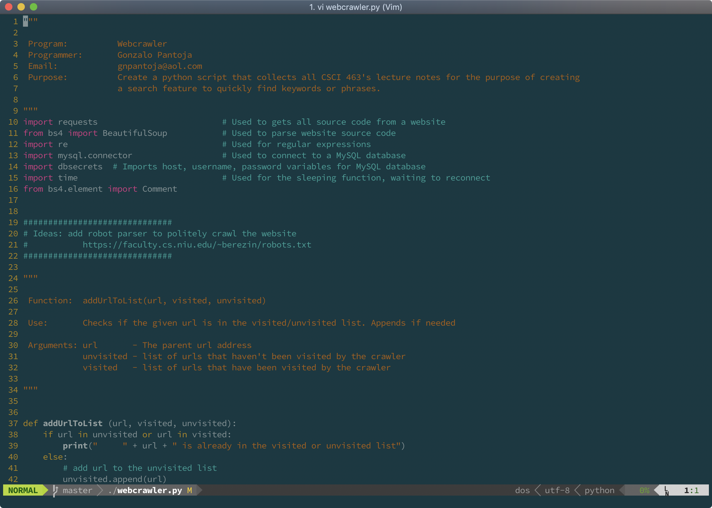

# vimrc
My personal vimrc configuration 



## Install 

1. Introduction:

   Installation requires [Git](https://git-scm.com/) and triggers `git clone` for each configured repository to `~/.vim/bundle/` by default.
   Curl is required for search.

   If you are using Windows, go directly to [Windows setup](https://github.com/VundleVim/Vundle.vim/wiki/Vundle-for-Windows). If you run into any issues, please consult the [FAQ](https://github.com/VundleVim/Vundle.vim/wiki).
   See [Tips](https://github.com/VundleVim/Vundle.vim/wiki/Tips-and-Tricks) for some advanced configurations.

   Using non-POSIX shells, such as the popular Fish shell, requires additional setup. Please check the [FAQ](https://github.com/VundleVim/Vundle.vim/wiki).

2. Set up [Vundle](https://github.com/VundleVim/Vundle.vim):

   ` git clone https://github.com/VundleVim/Vundle.vim.git ~/.vim/bundle/Vundle.vim`

3. Download [.vimrc](https://github.com/Gonzalo8642/vimrc)
   ```
   git clone https://github.com/Gonzalo8642/vimrc.git
   mv ~/.vimrc ~/.vimrc.old   #Save current vimrc settings 
   cd vimrc                   #Change into vimrc directory
   cp .vimrc ~/.vimrc         #Copy my vimrc into your home dir
   ```

4. Install Plugins:

   Launch `vim` and run `:PluginInstall`

   To install from command line: `vim +PluginInstall +qall`
